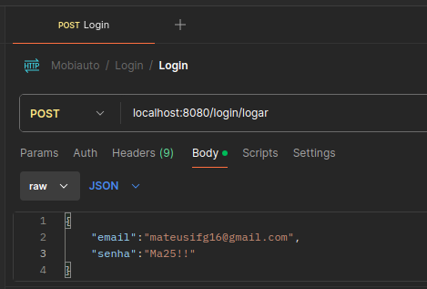
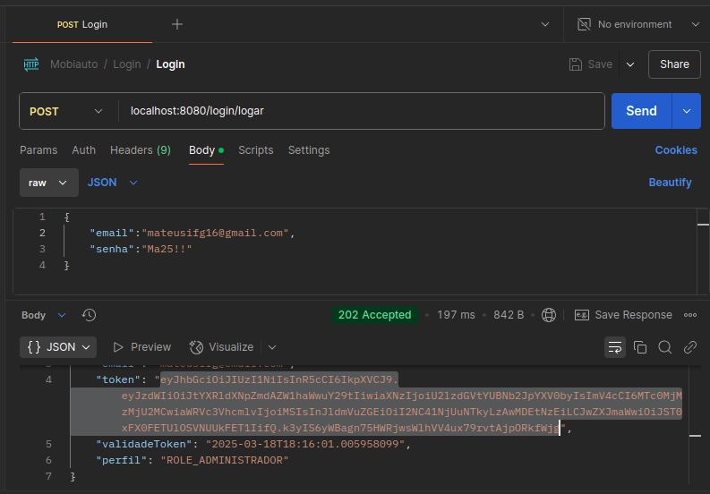
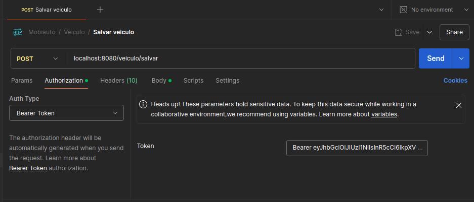
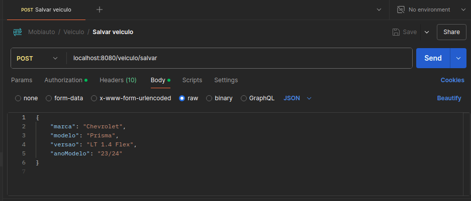
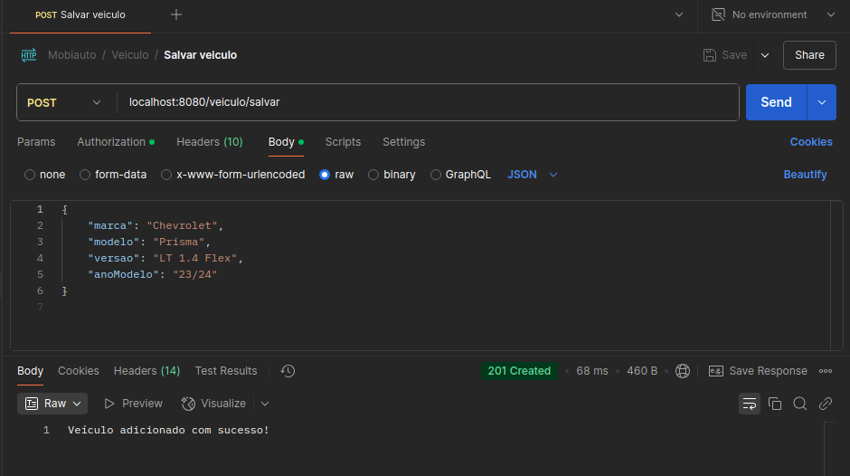

## Introdução

Esta aplicação foi desenvolvida como teste prático para simular a gestão de Revendas de Veículos da Mobiauto.

Ela oferece funcionalidades como:
- Login no sistema
- Usuários: Salvar, Listar, Listar por ID, Atualizar e Deletar
- Revenda: Salvar, Listar, Listar por ID, Listar por CNPJ, Atualizar e Adicionar usuário à revenda
- Oportunidade: Criar, Concluir, Transferir, Listar, Listar por ID, Atualizar
- Cliente: Salvar e Listar
- Veículo: Salvar e Listar
- Atendimento: Atender e Listar

## Visão Geral

### 📝 Pré-requisitos

Para executar a aplicação, são necessários os seguintes softwares e bibliotecas:

- Java 23 (JDK)
- Docker e Docker Compose (Para rodar o container da aplicação)
- MySQL (Com ou sem interface gráfica)
- Maven 3.8.7 (Para rodar testes unitários)
- Postman (Para fazer requisições HTTP)

### Arquitetura da Aplicação

A aplicação segue uma arquitetura monolítica e segue os padrões de API REST, contendo os seguintes componentes principais:
- **Autenticação e Validação** - Gerencia a autenticação de usuários e a validação de permissões com base nos níveis de acesso.
- **DTOs (Data Transfer Objects)** - Define objetos para transferência de dados entre camadas da aplicação, garantindo segurança e padronização nas respostas.
- **Mappers** - Responsáveis por converter entidades do banco de dados em DTOs e vice-versa, facilitando a comunicação entre a camada de persistência e a aplicação.
- **Utils (Utilitários)** - Conjunto de classes auxiliares que fornecem funcionalidades reutilizáveis, como formatação de dados, conversões e manipulações de strings.
- **Controllers** - Intermediários entre as requisições HTTP e a lógica de negócio, processando solicitações e retornando respostas adequadas.
- **Serviços (Services)** - Contêm a lógica de negócio da aplicação, implementando regras para gestão de usuários, revendas, oportunidades, clientes, veículos e atendimentos.
- **Banco de Dados** - Armazena todas as informações da aplicação, garantindo persistência e integridade dos dados.

## Configuração e Variáveis de Ambiente

### 📦 Configuração com Docker Compose

```yaml
services:
  mysql:
    image: mysql:8
    environment:
      MYSQL_ROOT_PASSWORD: ifhonese  # Senha do root
    container_name: mysql_db
    restart: always
    ports:
      - "3306:3306"
    volumes:
      - mysql_data:/var/lib/mysql
    networks:
      - minha_rede
    healthcheck:
      test: ["CMD", "mysqladmin", "ping", "-h", "localhost", "-uroot", "-pifhonese"]
      interval: 10s
      timeout: 5s
      retries: 5

  app:
    build: .
    container_name: mobiauto_api
    restart: always
    depends_on:
      mysql:
        condition: service_healthy  # Aguarda o MySQL estar pronto antes de iniciar o app
    environment:
      SPRING_DATASOURCE_URL: jdbc:mysql://mysql:3306/dbmobiauto?useSSL=false&serverTimezone=America/Sao_Paulo
      SPRING_DATASOURCE_USERNAME: root
      SPRING_DATASOURCE_PASSWORD: ifhonese
      SPRING_JPA_HIBERNATE_DDL_AUTO: update
      SERVER_PORT: 8080
    ports:
      - "8080:8080"
    networks:
      - minha_rede

volumes:
  mysql_data:

networks:
  minha_rede:
```

### 🌍 Variáveis de Ambiente

A aplicação utiliza as seguintes variáveis de ambiente, que podem ser configuradas no `docker-compose.yml` ou diretamente no ambiente:

| Variável                  | Descrição                                                  | Valor Padrão                  |
|---------------------------|----------------------------------------------------------|--------------------------------|
| `SPRING_DATASOURCE_URL`   | URL de conexão com o banco de dados MySQL               | `jdbc:mysql://mysql:3306/dbmobiauto?useSSL=false&serverTimezone=America/Sao_Paulo` |
| `SPRING_DATASOURCE_USERNAME` | Usuário do banco de dados                            | `root`                         |
| `SPRING_DATASOURCE_PASSWORD` | Senha do banco de dados                             | `sua_senha`                    |
| `SPRING_JPA_HIBERNATE_DDL_AUTO` | Configuração do Hibernate para criação do schema | `update`                        |
| `SERVER_PORT`             | Porta onde a aplicação será executada                   | `8080`                          |

### Como rodar testes unitários?

1. Abra o projeto em uma IDE ou acesse o diretório pelo terminal.
2. Digite o comando:

```sh
mvn clean test
```

### Como rodar o projeto em container?

1. Gere o JAR:

```sh
./mvnw clean package -DskipTests
```

2. Suba os containers:

```sh
docker-compose up -d --build
```

3. Verifique os logs:

```sh
docker logs -f mobiauto_api
```

4. Entre no MySQL:

```sh
docker exec -it mysql_db mysql -u root -p
```

5. Crie o banco de dados:

```sql
CREATE DATABASE dbmobiauto;
```

6. Saia do MySQL:

```sh
exit
```

7. Reinicie a aplicação:

```sh
docker restart mobiauto_api
```

8. Insira alguns registros no banco de dados:
```sh
docker exec -it mysql_db mysql -u root -p
```
```sql
USE dbmobiauto;

INSERT INTO revenda (cnpj, nome_social) VALUES ('64.565.592/0001-71', 'Revenda XYZ');

INSERT INTO usuario (nome, email, senha, perfil, token, revenda_id) VALUES
('Mateus Elias Vieira', 'mateusifg16@gmail.com', '$2a$10$ro/9tN2cBbiqMYqI61H0OO5HBMkI9.So27F48Slyuc6PbWlNgDSS2', 0, 'token123', 1);

INSERT INTO cliente (nome, email, telefone) VALUES
('Maria Oliveira', 'maria@email.com', '(11)99999-9999');

INSERT INTO veiculo (marca, modelo, versao, ano_modelo) VALUES
('Toyota', 'Corolla', 'XEI 2.0', '23/24');

INSERT INTO oportunidade (status, motivo_da_conclusao, data_de_atribuicao, data_de_conclusao, revenda_id, cliente_id, veiculo_id, usuario_id) VALUES
(0, NULL, '2024-03-16 10:00:00', NULL, 1, 1, 1, 1);

INSERT INTO atendimento (data_atendimento, observacoes, usuario_id, oportunidade_id) VALUES
('2024-03-16 14:00:00', 'Cliente interessado no veículo', 1, 1);
```

9. Saia do MySQL:

```sh
exit
```

10. Importe o arquivo Postman "Requests.json" (está na raíz do projeto) e teste as requisições.

### Como rodar o projeto sem container?
Requisitos: IDE, MySQL, Maven e Postman

1. Abra o projeto na IDE
2. Inicie o mysql
3. Crie o banco de dados: 
```sql
   create database dbmobiauto;
```
4. Inicie o projeto na IDE (O Spring será iniciado e será construido as tabelas do banco)
5. Vá no MySQL e insira alguns registros de testes:
```sql
USE dbmobiauto;

INSERT INTO revenda (cnpj, nome_social) VALUES ('64.565.592/0001-71', 'Revenda XYZ');

INSERT INTO usuario (nome, email, senha, perfil, token, revenda_id) VALUES
('Mateus Elias Vieira', 'mateusifg16@gmail.com', '$2a$10$ro/9tN2cBbiqMYqI61H0OO5HBMkI9.So27F48Slyuc6PbWlNgDSS2', 0, 'token123', 1);

INSERT INTO cliente (nome, email, telefone) VALUES
('Maria Oliveira', 'maria@email.com', '(11)99999-9999');

INSERT INTO veiculo (marca, modelo, versao, ano_modelo) VALUES
('Toyota', 'Corolla', 'XEI 2.0', '23/24');

INSERT INTO oportunidade (status, motivo_da_conclusao, data_de_atribuicao, data_de_conclusao, revenda_id, cliente_id, veiculo_id, usuario_id) VALUES
(0, NULL, '2024-03-16 10:00:00', NULL, 1, 1, 1, 1);

INSERT INTO atendimento (data_atendimento, observacoes, usuario_id, oportunidade_id) VALUES
('2024-03-16 14:00:00', 'Cliente interessado no veículo', 1, 1);
```
6. Abra o postman (importe as requisições, caso não tenha importado ainda)
7. Faça as requisições

### Como fazer requisições no Postman?

1. Faça o login (O mysql e o projeto devem estar rodando)



2. Copie o token gerado na resposta



3. Selecione uma requisição (exemplo: salvar veículo)



4. Vá em **Authorization** 
5. Selecione o Auth Type para **Bearer Token**
6. No campo Token, escreva Bearer e cole o token (exemplo; Bearer token_copiado)
7. Vá na aba **Body** > **raw** e coloque o json referente ao veiculo, exemplo:



8. Logo abaixo podemos ver a resposta da API dizendo que o veículo foi adicionado com sucesso e um status 201 (Criado)



OBS: Assim deve ser feito para as outras requisições. E lembre-se, o token tem validade de 1 hora e após isso é preciso logar novamente no sistema.

## 📢 Suporte e Contato

### Canais de Comunicação

Para suporte, entre em contato através dos seguintes canais:

📧 **Email**: mateusifg16@gmail.com

📞 **WhatsApp**: (64) 99224-0834

### OBS: Não deu tempo de terminar todos os testes unitários, por isso está faltando os testes referentes aos serviços.
